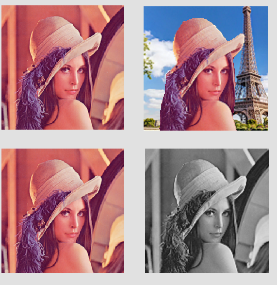

# image-manipulation
Image Manipulation examples with C++ using CImg library. 
This project has the tools to handle image files in C++ and process them.

## Requirements
Standart libraries from C++11 or higher. The project was developed using Dev-C++ but you can test on other softwares

## Requirements
Standart libraries from C++11 or higher. The project was developed using Dev-C++ but you can test on other softwares

## Image Processing Functions
These are the functions defined in the 'ImageEditor' class.

+ **Background**: Replaces the background of the image given a mask
+ **Blur**: Performs a Average blur on the supplied image.
+ **Cartoonized**: Gives a cartoonized image
+ **Denoised**: Removes the noise from the image using an median filter
+ **Gray**: Convert image to gray scale
+ **Portrait**: Applies a Portrait effect, blurring the background
+ **Sharpened**: Applies a Sharpening filter
+ **Sobel**: Applies a Sobel Filter in the image 

## Example

## Contributing
Pull requests are welcome. For major changes, please open an issue first to discuss what you would like to change.

Please make sure to update tests as appropriate.
